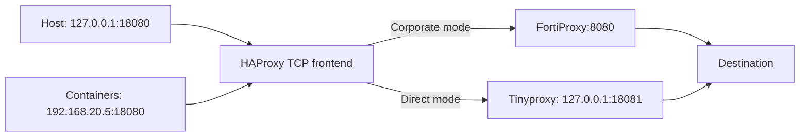

# Architecture

## Stable application endpoint

Each generated HAProxy configuration contains **one selected backend**. HAProxy forwards corporate TCP traffic without HTTP rewriting or TLS termination. Tinyproxy handles direct HTTP requests and HTTPS CONNECT tunnels. Client `NO_PROXY` settings handle destination exceptions.

There is no HAProxy fallback to direct on upstream failure. The controller can select direct after its configured failure threshold. Existing connections keep their old backend across graceful reloads; new connections use the selected route. Inactivity timeouts are one hour.

## Why retain HAProxy?

Tinyproxy can perform both direct and upstream proxying in principle. However, two authenticated OpenCode tests per configuration found HAProxy → FortiProxy completed 2/2 responses, while installed Tinyproxy 1.11.1 → FortiProxy completed 0/2, both with and without `Via`. Tinyproxy delivered text but never completed within 100 seconds.

HAProxy is a verified workaround for this installed combination. The exact protocol-level cause is unproven. Comparison evidence was recorded during development; those historical logs are deliberately excluded from this installer.

## One command, separate implementation concerns

`proxy` is the only executable. It owns state management and command dispatch. `lib/operations.py` contains Python implementations of synchronous reload and live verification. `tests/controller.sh` remains separate from production logic. Neither helper file needs an executable bit or a PATH entry.

This installer creates the `proxy` launcher. Status, toggle, stop, test, and verification use subcommands instead of individual wrappers. Docker uses its existing client configuration directly; no Docker wrapper or alias is installed. No shell-startup edits are needed when these implementation paths move.

## Route transaction

1. The user monitor probes the upstream hostname and port from `config/proxy.yaml` with a five-second pause between checks (probe duration is additional).
2. Two successes select corporate detection; three failures select direct detection.
3. Persisted `auto`, `force-on`, or `force-off` mode determines the desired route.
4. A global `flock` serializes changes. Pending intent is written first.
5. Configuration is replaced atomically; the endpoint's reload invokes `proxy __reload-haproxy`.
6. The Python helper validates HAProxy configuration and waits for the master CLI's `Success=1` acknowledgement.
7. The controller checks the master PID/listener, publishes canonical state, and clears pending intent.

Failures reassert canonical routing and retain retryable intent. A nonblocking restart fallback avoids a controller-lock/`ExecStartPre` deadlock. Explicit mode commands supersede stale pending intent. HAProxy DNS uses WSL's resolver configuration; unresolved corporate DNS does not activate a direct fallback.

## Services and ownership

| User service | Responsibility |
|---|---|
| `proxy-endpoint` | HAProxy master/worker; render canonical configuration at startup |
| `proxy-direct` | Direct-only Tinyproxy |
| `proxy-monitor` | Detection, state persistence, route changes |

All run as the registered developer. Root is used only for installation/bootstrap; lingering enables user-service startup without interactive login. WSL itself must be running. The package-supplied root HAProxy service is disabled.

Listeners are restricted to the two stable addresses and loopback backend. Frontend sources are limited to `127.0.0.1/32`, `192.168.20.0/24`, and `172.30.0.0/24`. The private master socket is under `/run/user/1000/proxy-endpoint/`. WSL host-to-bridge traffic appears as `10.255.255.254` and is intentionally rejected; host clients use loopback, while actual approved containers use the bridge endpoint.

Root-owned APT/Docker-daemon settings permanently reference stable endpoints. Route changes do not modify those files, Docker credentials, or CA bundles. Container CA trust is supplied independently.

## Verification boundary

`proxy test` covers debounce, state parsing, atomic transitions, concurrent operations, pending recovery, and rollback in isolation. `proxy verify on|off` tests services, host and shell access, unprivileged APT updates, image pulls and uncached HTTP/HTTPS builds, both container networks, and authenticated streaming. It uses the public SUSE and company base images documented in the README. Corporate image checks require the corporate route. Repository signature failures remain visible as acceptance failures.

Integration checks have also demonstrated byte preservation, graceful connection retention, invalid-config rejection, and no backend fallback. Actual VPN-off and WSL restart checks remain required for final acceptance; simulated transitions and enabled services do not prove them.

References: [Tinyproxy configuration](https://tinyproxy.github.io/), [HAProxy master CLI reload](https://docs.haproxy.org/2.8/management.html#9.4).

## Configuration ownership

The user-owned `config/proxy.yaml` supplies the upstream hostname and port. A shared Python validator is used by the installer bootstrap and controller. Each monitor check launches the controller afresh, rereads configuration and compares the generated HAProxy configuration before reloading. Local endpoints stay stable, so upstream changes need no root integration changes. Certificate provisioning is outside the installer.
